
---
layout: post
title:"pands practice"
---
## pandas


```python
import pandas as pd

animals=['Tigers', 'Bears', 'Moose']
p= pd.Series(animals)
print(p)
```

    0    Tigers
    1     Bears
    2     Moose
    dtype: object
    


```python
numbers=[1,2,3]
nums=pd.Series(numbers)
print(nums)
```

    0    1
    1    2
    2    3
    dtype: int64
    


```python
pd.Series([1,2,3])
```




    0    1
    1    2
    2    3
    dtype: int64




```python
diction={'a':1, 'b':2, 'c':3}
d_1 = pd.Series(diction)
print(d_1)
```

    a    1
    b    2
    c    3
    dtype: int64
    


```python
사전 = {1:'나', 2:'너', 3:'우리'};
사전[3]
```




    '우리'




```python
import numpy as np
my_2d_array = np.array([[1,2,3],[4,5,6]])
pd.DataFrame(my_2d_array)
```




<div>
<style scoped>
    .dataframe tbody tr th:only-of-type {
        vertical-align: middle;
    }

    .dataframe tbody tr th {
        vertical-align: top;
    }

    .dataframe thead th {
        text-align: right;
    }
</style>
<table border="1" class="dataframe">
  <thead>
    <tr style="text-align: right;">
      <th></th>
      <th>0</th>
      <th>1</th>
      <th>2</th>
    </tr>
  </thead>
  <tbody>
    <tr>
      <th>0</th>
      <td>1</td>
      <td>2</td>
      <td>3</td>
    </tr>
    <tr>
      <th>1</th>
      <td>4</td>
      <td>5</td>
      <td>6</td>
    </tr>
  </tbody>
</table>
</div>




```python
my_dict= {'a':['1','3'], 'b':['1','2'], 'c':['2','4']}
pd.DataFrame(my_dict)
```




<div>
<style scoped>
    .dataframe tbody tr th:only-of-type {
        vertical-align: middle;
    }

    .dataframe tbody tr th {
        vertical-align: top;
    }

    .dataframe thead th {
        text-align: right;
    }
</style>
<table border="1" class="dataframe">
  <thead>
    <tr style="text-align: right;">
      <th></th>
      <th>a</th>
      <th>b</th>
      <th>c</th>
    </tr>
  </thead>
  <tbody>
    <tr>
      <th>0</th>
      <td>1</td>
      <td>1</td>
      <td>2</td>
    </tr>
    <tr>
      <th>1</th>
      <td>3</td>
      <td>2</td>
      <td>4</td>
    </tr>
  </tbody>
</table>
</div>




```python
my_df= pd.DataFrame(data=[4,5,6,7], index=range(0,4), columns=['A'])
pd.DataFrame(my_df)
```




<div>
<style scoped>
    .dataframe tbody tr th:only-of-type {
        vertical-align: middle;
    }

    .dataframe tbody tr th {
        vertical-align: top;
    }

    .dataframe thead th {
        text-align: right;
    }
</style>
<table border="1" class="dataframe">
  <thead>
    <tr style="text-align: right;">
      <th></th>
      <th>A</th>
    </tr>
  </thead>
  <tbody>
    <tr>
      <th>0</th>
      <td>4</td>
    </tr>
    <tr>
      <th>1</th>
      <td>5</td>
    </tr>
    <tr>
      <th>2</th>
      <td>6</td>
    </tr>
    <tr>
      <th>3</th>
      <td>7</td>
    </tr>
  </tbody>
</table>
</div>




```python
dict_data= {'c0': [1,2,3], 'c1': [4,5,6], 'c2': [7,8,9], 'c3':[10,11,12], 'c4': [13,14,15]}

df= pd.DataFrame(dict_data)
print(type(df))
print(df)
print(type(dict_data))
```

    <class 'pandas.core.frame.DataFrame'>
       c0  c1  c2  c3  c4
    0   1   4   7  10  13
    1   2   5   8  11  14
    2   3   6   9  12  15
    <class 'dict'>
    


```python
df= pd.DataFrame([[15,'M', '남중'], [17,'W', '여중']],
                index= ['철수', '영희'],
                columns= ['나이', '성별', '학교'])
print(df)
```

        나이 성별  학교
    철수  15  M  남중
    영희  17  W  여중
    


```python
df.index
```




    Index(['철수', '영희'], dtype='object')




```python
df.columns
```




    Index(['나이', '성별', '학교'], dtype='object')




```python
df
```




<div>
<style scoped>
    .dataframe tbody tr th:only-of-type {
        vertical-align: middle;
    }

    .dataframe tbody tr th {
        vertical-align: top;
    }

    .dataframe thead th {
        text-align: right;
    }
</style>
<table border="1" class="dataframe">
  <thead>
    <tr style="text-align: right;">
      <th></th>
      <th>나이</th>
      <th>성별</th>
      <th>학교</th>
    </tr>
  </thead>
  <tbody>
    <tr>
      <th>철수</th>
      <td>15</td>
      <td>M</td>
      <td>남중</td>
    </tr>
    <tr>
      <th>영희</th>
      <td>17</td>
      <td>W</td>
      <td>여중</td>
    </tr>
  </tbody>
</table>
</div>




```python
df.drop('철수')
```




<div>
<style scoped>
    .dataframe tbody tr th:only-of-type {
        vertical-align: middle;
    }

    .dataframe tbody tr th {
        vertical-align: top;
    }

    .dataframe thead th {
        text-align: right;
    }
</style>
<table border="1" class="dataframe">
  <thead>
    <tr style="text-align: right;">
      <th></th>
      <th>나이</th>
      <th>성별</th>
      <th>학교</th>
    </tr>
  </thead>
  <tbody>
    <tr>
      <th>영희</th>
      <td>17</td>
      <td>W</td>
      <td>여중</td>
    </tr>
  </tbody>
</table>
</div>




```python
df
```




<div>
<style scoped>
    .dataframe tbody tr th:only-of-type {
        vertical-align: middle;
    }

    .dataframe tbody tr th {
        vertical-align: top;
    }

    .dataframe thead th {
        text-align: right;
    }
</style>
<table border="1" class="dataframe">
  <thead>
    <tr style="text-align: right;">
      <th></th>
      <th>나이</th>
      <th>성별</th>
      <th>학교</th>
    </tr>
  </thead>
  <tbody>
    <tr>
      <th>철수</th>
      <td>15</td>
      <td>M</td>
      <td>남중</td>
    </tr>
    <tr>
      <th>영희</th>
      <td>17</td>
      <td>W</td>
      <td>여중</td>
    </tr>
  </tbody>
</table>
</div>




```python
df.drop(['철수','영희'])
```




<div>
<style scoped>
    .dataframe tbody tr th:only-of-type {
        vertical-align: middle;
    }

    .dataframe tbody tr th {
        vertical-align: top;
    }

    .dataframe thead th {
        text-align: right;
    }
</style>
<table border="1" class="dataframe">
  <thead>
    <tr style="text-align: right;">
      <th></th>
      <th>나이</th>
      <th>성별</th>
      <th>학교</th>
    </tr>
  </thead>
  <tbody>
  </tbody>
</table>
</div>




```python
df.drop('철수', axis=0, inplace= True)
```


```python
df
```




<div>
<style scoped>
    .dataframe tbody tr th:only-of-type {
        vertical-align: middle;
    }

    .dataframe tbody tr th {
        vertical-align: top;
    }

    .dataframe thead th {
        text-align: right;
    }
</style>
<table border="1" class="dataframe">
  <thead>
    <tr style="text-align: right;">
      <th></th>
      <th>나이</th>
      <th>성별</th>
      <th>학교</th>
    </tr>
  </thead>
  <tbody>
    <tr>
      <th>영희</th>
      <td>17</td>
      <td>W</td>
      <td>여중</td>
    </tr>
  </tbody>
</table>
</div>




```python
df2=df
df2.drop('나이', axis=1)
```




<div>
<style scoped>
    .dataframe tbody tr th:only-of-type {
        vertical-align: middle;
    }

    .dataframe tbody tr th {
        vertical-align: top;
    }

    .dataframe thead th {
        text-align: right;
    }
</style>
<table border="1" class="dataframe">
  <thead>
    <tr style="text-align: right;">
      <th></th>
      <th>성별</th>
      <th>학교</th>
    </tr>
  </thead>
  <tbody>
    <tr>
      <th>영희</th>
      <td>W</td>
      <td>여중</td>
    </tr>
  </tbody>
</table>
</div>




```python
df2
```




<div>
<style scoped>
    .dataframe tbody tr th:only-of-type {
        vertical-align: middle;
    }

    .dataframe tbody tr th {
        vertical-align: top;
    }

    .dataframe thead th {
        text-align: right;
    }
</style>
<table border="1" class="dataframe">
  <thead>
    <tr style="text-align: right;">
      <th></th>
      <th>나이</th>
      <th>성별</th>
      <th>학교</th>
    </tr>
  </thead>
  <tbody>
    <tr>
      <th>영희</th>
      <td>17</td>
      <td>W</td>
      <td>여중</td>
    </tr>
  </tbody>
</table>
</div>




```python
df2.drop(['나이', '성별'], axis=1)
```




<div>
<style scoped>
    .dataframe tbody tr th:only-of-type {
        vertical-align: middle;
    }

    .dataframe tbody tr th {
        vertical-align: top;
    }

    .dataframe thead th {
        text-align: right;
    }
</style>
<table border="1" class="dataframe">
  <thead>
    <tr style="text-align: right;">
      <th></th>
      <th>학교</th>
    </tr>
  </thead>
  <tbody>
    <tr>
      <th>영희</th>
      <td>여중</td>
    </tr>
  </tbody>
</table>
</div>




```python
df= pd.DataFrame([90,98,85,100],[80,89,95,90],[70,95,100,90],
                index=['서준','우현','인아'],
                columns=['수학', '영어', '음악', '체육'])
df
```


    ---------------------------------------------------------------------------

    TypeError                                 Traceback (most recent call last)

    <ipython-input-35-d7eb8ce44659> in <module>
          1 df= pd.DataFrame([90,98,85,100],[80,89,95,90],[70,95,100,90],
          2                 index=['서준','우현','인아'],
    ----> 3                 columns=['수학', '영어', '음악', '체육'])
          4 df
    

    TypeError: __init__() got multiple values for argument 'index'



```python
exam={'수학':[90,80,70], '영어':[98,89,95], '음악': [85,95,100], '체육': [100,90,90]}
df=pd.DataFrame(exam, index=['서준', '우현', '인아'])
```


```python
df
```




<div>
<style scoped>
    .dataframe tbody tr th:only-of-type {
        vertical-align: middle;
    }

    .dataframe tbody tr th {
        vertical-align: top;
    }

    .dataframe thead th {
        text-align: right;
    }
</style>
<table border="1" class="dataframe">
  <thead>
    <tr style="text-align: right;">
      <th></th>
      <th>수학</th>
      <th>영어</th>
      <th>음악</th>
      <th>체육</th>
    </tr>
  </thead>
  <tbody>
    <tr>
      <th>서준</th>
      <td>90</td>
      <td>98</td>
      <td>85</td>
      <td>100</td>
    </tr>
    <tr>
      <th>우현</th>
      <td>80</td>
      <td>89</td>
      <td>95</td>
      <td>90</td>
    </tr>
    <tr>
      <th>인아</th>
      <td>70</td>
      <td>95</td>
      <td>100</td>
      <td>90</td>
    </tr>
  </tbody>
</table>
</div>




```python
df.loc['서준']
```




    수학     90
    영어     98
    음악     85
    체육    100
    Name: 서준, dtype: int64




```python
df.loc[['서준','인아']]
```




<div>
<style scoped>
    .dataframe tbody tr th:only-of-type {
        vertical-align: middle;
    }

    .dataframe tbody tr th {
        vertical-align: top;
    }

    .dataframe thead th {
        text-align: right;
    }
</style>
<table border="1" class="dataframe">
  <thead>
    <tr style="text-align: right;">
      <th></th>
      <th>수학</th>
      <th>영어</th>
      <th>음악</th>
      <th>체육</th>
    </tr>
  </thead>
  <tbody>
    <tr>
      <th>서준</th>
      <td>90</td>
      <td>98</td>
      <td>85</td>
      <td>100</td>
    </tr>
    <tr>
      <th>인아</th>
      <td>70</td>
      <td>95</td>
      <td>100</td>
      <td>90</td>
    </tr>
  </tbody>
</table>
</div>




```python
df.iloc[0]
```




    수학     90
    영어     98
    음악     85
    체육    100
    Name: 서준, dtype: int64




```python
df.iloc[0:2]
```




<div>
<style scoped>
    .dataframe tbody tr th:only-of-type {
        vertical-align: middle;
    }

    .dataframe tbody tr th {
        vertical-align: top;
    }

    .dataframe thead th {
        text-align: right;
    }
</style>
<table border="1" class="dataframe">
  <thead>
    <tr style="text-align: right;">
      <th></th>
      <th>수학</th>
      <th>영어</th>
      <th>음악</th>
      <th>체육</th>
    </tr>
  </thead>
  <tbody>
    <tr>
      <th>서준</th>
      <td>90</td>
      <td>98</td>
      <td>85</td>
      <td>100</td>
    </tr>
    <tr>
      <th>우현</th>
      <td>80</td>
      <td>89</td>
      <td>95</td>
      <td>90</td>
    </tr>
  </tbody>
</table>
</div>




```python
df.loc[['서준']]
```




<div>
<style scoped>
    .dataframe tbody tr th:only-of-type {
        vertical-align: middle;
    }

    .dataframe tbody tr th {
        vertical-align: top;
    }

    .dataframe thead th {
        text-align: right;
    }
</style>
<table border="1" class="dataframe">
  <thead>
    <tr style="text-align: right;">
      <th></th>
      <th>수학</th>
      <th>영어</th>
      <th>음악</th>
      <th>체육</th>
    </tr>
  </thead>
  <tbody>
    <tr>
      <th>서준</th>
      <td>90</td>
      <td>98</td>
      <td>85</td>
      <td>100</td>
    </tr>
  </tbody>
</table>
</div>




```python
df.수학
```




    서준    90
    우현    80
    인아    70
    Name: 수학, dtype: int64




```python
df.영어
```




    서준    98
    우현    89
    인아    95
    Name: 영어, dtype: int64




```python
df[['음악', '체육']]
```




<div>
<style scoped>
    .dataframe tbody tr th:only-of-type {
        vertical-align: middle;
    }

    .dataframe tbody tr th {
        vertical-align: top;
    }

    .dataframe thead th {
        text-align: right;
    }
</style>
<table border="1" class="dataframe">
  <thead>
    <tr style="text-align: right;">
      <th></th>
      <th>음악</th>
      <th>체육</th>
    </tr>
  </thead>
  <tbody>
    <tr>
      <th>서준</th>
      <td>85</td>
      <td>100</td>
    </tr>
    <tr>
      <th>우현</th>
      <td>95</td>
      <td>90</td>
    </tr>
    <tr>
      <th>인아</th>
      <td>100</td>
      <td>90</td>
    </tr>
  </tbody>
</table>
</div>




```python
pwd()
```




    'C:\\Users\\geonb_000'




```python
import pandas as pd
import matplotlib.pyplot as plt

df = pd.read_csv('./auto-mpg.csv', header= None)
df.columns = ['mpg','cylinders','displacement','horsepower','weight','acceleration',
             'model_year','origin','name']

print(df.head())
print(df.tail())
print(df.shape)
print(df.info())
print(df.dtypes)
print(df.mpg.dtypes)
print(df.describe())
print(df.describe(include='all'))
```

        mpg  cylinders  displacement horsepower  weight  acceleration  model_year  \
    0  18.0          8         307.0      130.0  3504.0          12.0          70   
    1  15.0          8         350.0      165.0  3693.0          11.5          70   
    2  18.0          8         318.0      150.0  3436.0          11.0          70   
    3  16.0          8         304.0      150.0  3433.0          12.0          70   
    4  17.0          8         302.0      140.0  3449.0          10.5          70   
    
       origin                       name  
    0       1  chevrolet chevelle malibu  
    1       1          buick skylark 320  
    2       1         plymouth satellite  
    3       1              amc rebel sst  
    4       1                ford torino  
          mpg  cylinders  displacement horsepower  weight  acceleration  \
    393  27.0          4         140.0      86.00  2790.0          15.6   
    394  44.0          4          97.0      52.00  2130.0          24.6   
    395  32.0          4         135.0      84.00  2295.0          11.6   
    396  28.0          4         120.0      79.00  2625.0          18.6   
    397  31.0          4         119.0      82.00  2720.0          19.4   
    
         model_year  origin             name  
    393          82       1  ford mustang gl  
    394          82       2        vw pickup  
    395          82       1    dodge rampage  
    396          82       1      ford ranger  
    397          82       1       chevy s-10  
    (398, 9)
    <class 'pandas.core.frame.DataFrame'>
    RangeIndex: 398 entries, 0 to 397
    Data columns (total 9 columns):
    mpg             398 non-null float64
    cylinders       398 non-null int64
    displacement    398 non-null float64
    horsepower      398 non-null object
    weight          398 non-null float64
    acceleration    398 non-null float64
    model_year      398 non-null int64
    origin          398 non-null int64
    name            398 non-null object
    dtypes: float64(4), int64(3), object(2)
    memory usage: 28.1+ KB
    None
    mpg             float64
    cylinders         int64
    displacement    float64
    horsepower       object
    weight          float64
    acceleration    float64
    model_year        int64
    origin            int64
    name             object
    dtype: object
    float64
                  mpg   cylinders  displacement       weight  acceleration  \
    count  398.000000  398.000000    398.000000   398.000000    398.000000   
    mean    23.514573    5.454774    193.425879  2970.424623     15.568090   
    std      7.815984    1.701004    104.269838   846.841774      2.757689   
    min      9.000000    3.000000     68.000000  1613.000000      8.000000   
    25%     17.500000    4.000000    104.250000  2223.750000     13.825000   
    50%     23.000000    4.000000    148.500000  2803.500000     15.500000   
    75%     29.000000    8.000000    262.000000  3608.000000     17.175000   
    max     46.600000    8.000000    455.000000  5140.000000     24.800000   
    
           model_year      origin  
    count  398.000000  398.000000  
    mean    76.010050    1.572864  
    std      3.697627    0.802055  
    min     70.000000    1.000000  
    25%     73.000000    1.000000  
    50%     76.000000    1.000000  
    75%     79.000000    2.000000  
    max     82.000000    3.000000  
                   mpg   cylinders  displacement horsepower       weight  \
    count   398.000000  398.000000    398.000000        398   398.000000   
    unique         NaN         NaN           NaN         94          NaN   
    top            NaN         NaN           NaN      150.0          NaN   
    freq           NaN         NaN           NaN         22          NaN   
    mean     23.514573    5.454774    193.425879        NaN  2970.424623   
    std       7.815984    1.701004    104.269838        NaN   846.841774   
    min       9.000000    3.000000     68.000000        NaN  1613.000000   
    25%      17.500000    4.000000    104.250000        NaN  2223.750000   
    50%      23.000000    4.000000    148.500000        NaN  2803.500000   
    75%      29.000000    8.000000    262.000000        NaN  3608.000000   
    max      46.600000    8.000000    455.000000        NaN  5140.000000   
    
            acceleration  model_year      origin        name  
    count     398.000000  398.000000  398.000000         398  
    unique           NaN         NaN         NaN         305  
    top              NaN         NaN         NaN  ford pinto  
    freq             NaN         NaN         NaN           6  
    mean       15.568090   76.010050    1.572864         NaN  
    std         2.757689    3.697627    0.802055         NaN  
    min         8.000000   70.000000    1.000000         NaN  
    25%        13.825000   73.000000    1.000000         NaN  
    50%        15.500000   76.000000    1.000000         NaN  
    75%        17.175000   79.000000    2.000000         NaN  
    max        24.800000   82.000000    3.000000         NaN  
    


```python
df.plot(kind='scatter', x='weight', y='mpg')
```




    <matplotlib.axes._subplots.AxesSubplot at 0x2b67c8f12b0>




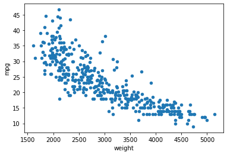



```python
df.plot(kind='scatter', x='weight', y='mpg', c='coral', s=15, figsize=(10,5))
```




    <matplotlib.axes._subplots.AxesSubplot at 0x2b67f9938d0>




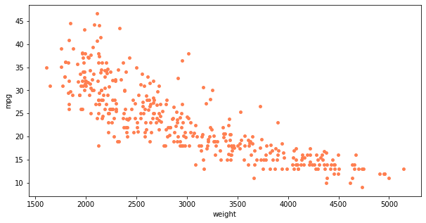



```python
df.plot(kind='scatter', x='weight', y='mpg', c='coral', s=15, figsize=(10,5))
plt.title('Scatter Plot - mpg vs. weight')
plt.show()
```


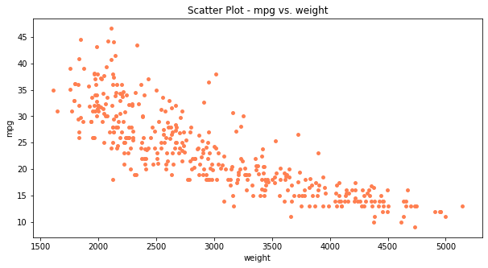



```python
plt.title('Scatter Plot - mpg vs. weight')
plt.show()
```






```python
plt.title('Scatter Plot - mpg vs. weight')
df.plot(kind='scatter', x='weight', y='mpg', c='coral', s=15, figsize=(10,5))
plt.show()
```


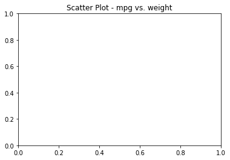







```python
import seaborn as sns

titanic = sns.load_dataset('titanic')
```


```python
sns.distplot(titanic['fare'])
```




    <matplotlib.axes._subplots.AxesSubplot at 0x2b6019e7278>




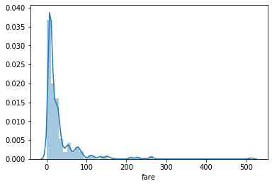



```python
sns.distplot(titanic['fare'], hist=False)
```




    <matplotlib.axes._subplots.AxesSubplot at 0x2b601b33b00>




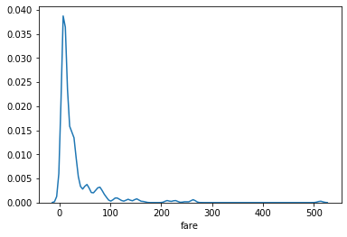



```python
sns.stripplot(x='class', y='age', data=titanic)
```




    <matplotlib.axes._subplots.AxesSubplot at 0x2b601b92d68>




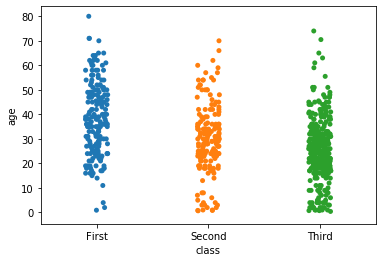



```python
sns.swarmplot(x='class', y='age', data=titanic)
```

    C:\Users\geonb_000\Anaconda3\lib\site-packages\seaborn\categorical.py:1324: RuntimeWarning: invalid value encountered in less
      off_low = points < low_gutter
    C:\Users\geonb_000\Anaconda3\lib\site-packages\seaborn\categorical.py:1328: RuntimeWarning: invalid value encountered in greater
      off_high = points > high_gutter
    




    <matplotlib.axes._subplots.AxesSubplot at 0x2b601b69d30>




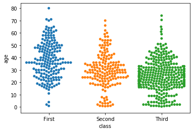



```python
sns.stripplot(x='class', y='age', data=titanic)
sns.swarmplot(x='class', y='age', data=titanic)
```




    <matplotlib.axes._subplots.AxesSubplot at 0x2b602c900f0>




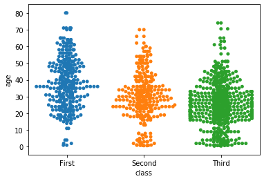



```python
sns.set_style('whitegrid')
sns.barplot(x='sex', y='survived', data=titanic)
```




    <matplotlib.axes._subplots.AxesSubplot at 0x2b602cdc0f0>




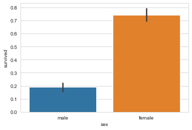



```python
sns.set_style('whitegrid')
sns.barplot(x='sex', y='survived', hue='class', data=titanic)
```




    <matplotlib.axes._subplots.AxesSubplot at 0x2b602d54c88>




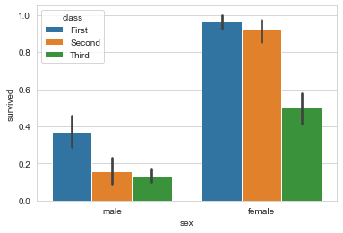



```python
sns.set_style('whitegrid')
sns.barplot(x='sex', y='survived', hue='class', dodge=False, data=titanic)
```




    <matplotlib.axes._subplots.AxesSubplot at 0x2b602ddba58>




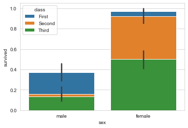



```python
sns.jointplot(x='fare', y='age', data=titanic)
```




    <seaborn.axisgrid.JointGrid at 0x2b602e53780>




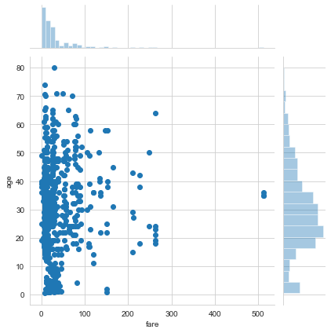



```python
sns.jointplot(x='fare', y='age', kind='kde',data=titanic)
```




    <seaborn.axisgrid.JointGrid at 0x2b602f78898>




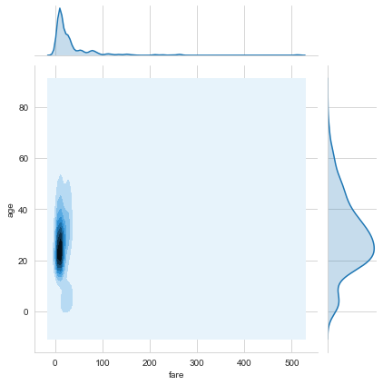



